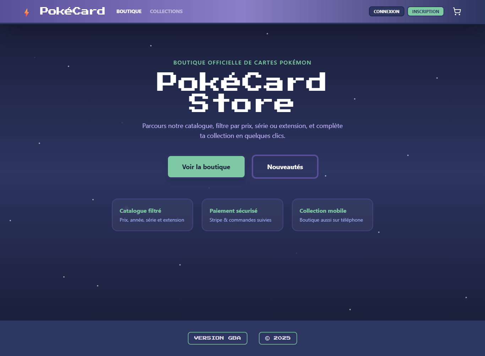

Document destiné au **client** et à l’**équipe technique** qui reprendra le projet.

# Architecture

```
┌──────────────┐  ┌──────────────┐  ┌─────────────────┐
│  Web React   │  │  Mobile Expo │  │ Admin Electron  │
└──────┬───────┘  └──────┬───────┘  └────────┬────────┘
       │                   │                    │
       └───────────────────┼────────────────────┘
                           │ HTTPS REST
                           ▼
              ┌────────────────────────┐
              │  API NestJS (Render)   │
              │  /api/*  +  Swagger    │
              └───────────┬────────────┘
                          │ Prisma
                          ▼
              ┌────────────────────────┐
              │  PostgreSQL (Neon)   │
              └────────────────────────┘
```

| Service | URL production |
|---------|----------------|
| Frontend | https://pokestore-hazel.vercel.app |
| API | https://pokestore-api-btz1.onrender.com/api |
| Swagger | https://pokestore-api-btz1.onrender.com/api/docs |

---

## 2. Stack

| Couche | Dossier | Technologies |
|--------|---------|--------------|
| Web | `frontend/` | React 19, Vite, TypeScript, Tailwind |
| API | `backend/` | NestJS 11, Prisma 6, PostgreSQL |
| Mobile | `mobile-rn/` | React Native, Expo 54 |
| Admin | `pokemon-electron/` | Electron Forge, React, `pg` |
| BDD | Neon | PostgreSQL managé |

---

## 3. Modèle de données (Prisma)

Fichier : `backend/prisma/schema.prisma`

| Modèle | Rôle |
|--------|------|
| `User` | Comptes (`role`: USER \| ADMIN) |
| `PokemonCard` | Catalogue |
| `Cart` / `CartItem` | Panier |
| `Order` / `OrderItem` | Commandes (`PENDING`, `PAID`, `CANCELLED`) |
| `Favorite` | Favoris (prévu, UI non livrée) |

Index sur : `price`, `releaseYear`, `series`, `tcgSetId`.

---

## 4. API — endpoints principaux

| Méthode | Route | Auth | Description |
|---------|-------|------|-------------|
| POST | `/api/auth/register` | — | Inscription |
| POST | `/api/auth/login` | — | Connexion client |
| POST | `/api/auth/admin/login` | — | Connexion admin |
| GET | `/api/auth/google` | — | OAuth web |
| GET | `/api/auth/google/mobile` | — | OAuth mobile |
| GET | `/api/cards` | — | Catalogue |
| GET | `/api/cards/meta` | — | Filtres |
| GET | `/api/cards/import` | JWT + ADMIN | Import cartes |
| GET | `/api/cards/reprice` | JWT + ADMIN | Recalcul prix |
| GET/POST/PATCH/DELETE | `/api/cart/*` | JWT | Panier |
| POST | `/api/orders/checkout-session` | JWT | Stripe |
| GET | `/api/orders` | JWT | Commandes |
| GET | `/api/contact/captcha` | — | Captcha |
| POST | `/api/contact` | — | Contact |
| POST | `/api/stripe/webhook` | Signature | Webhook Stripe |

Liste complète : **Swagger** `/api/docs`

---

## 5. Sécurité

| Mesure | Implémentation |
|--------|----------------|
| Mots de passe | bcrypt |
| Sessions API | JWT |
| Routes protégées | `JwtAuthGuard`, `AdminGuard` |
| Headers HTTP | Helmet |
| Rate limiting | `@nestjs/throttler` (POST ; login limité) |
| Contact | Captcha HMAC + honeypot + rate limit IP |
| Paiement | Vérification signature webhook Stripe |
| CORS | Domaines Vercel + localhost |

---

## 6. Déploiement

| Composant | Hébergeur | Fichier config |
|-----------|-----------|----------------|
| Web | Vercel | `frontend/vercel.json` |
| API | Render | variables d’env dashboard |
| BDD | Neon | `DATABASE_URL` |
| APK | EAS (Expo) | `mobile-rn/eas.json` |
| Admin `.exe` | Build local | `pokemon-electron/` → `npm run make` |

Guide : `DEPLOY.md`, `README.md`

**Limitation connue :** Render plan gratuit → cold start ~30–60 s après inactivité.

---

## 7. Variables d’environnement

Modèles sans secrets : `backend/.env.example`, `frontend/.env.example`, `mobile-rn/.env.example`, `pokemon-electron/.env.example`.

| Variable | Service | Rôle |
|----------|---------|------|
| `DATABASE_URL` | Backend, Electron | PostgreSQL |
| `JWT_SECRET` | Backend | Tokens |
| `FRONTEND_URL` | Backend | CORS, OAuth |
| `STRIPE_*` | Backend | Paiement |
| `RESEND_*` | Backend | Emails prod |
| `GOOGLE_CLIENT_*` | Backend | OAuth |
| `VITE_API_URL` | Frontend | URL API |
| `EXPO_PUBLIC_API_URL` | Mobile | URL API |
| `POKEMON_APP_API_URL` | Electron | URL API |

Les **secrets** sont configurés sur les dashboards hébergeurs, jamais dans Git.

---

## 8. Installation locale (développeur)

```bash
# API
cd backend && npm install && cp .env.example .env
npx prisma migrate dev && npm run db:seed && npm run db:seed:admin
npm run start:dev

# Web
cd frontend && npm install && cp .env.example .env && npm run dev

# Mobile
cd mobile-rn && npm install && npm start

# Admin
cd pokemon-electron && npm install && npm start
```

---

## 9. Tests

| Type | Commande | Résultat |
|------|----------|----------|
| Unitaires backend | `cd backend && npm test` | 7/7 |
| E2E web | `cd frontend && npm run test:e2e` | 7/7 |
| Captures | `docs/tests/` | Playwright + Jest |




---

## 10. Structure du dépôt

```
pokemon-app/
├── backend/           # API
├── frontend/          # Web
├── mobile-rn/         # Mobile
├── docs/
│   ├── PokeStore-Livraison-Client/   # Word client
│   └── scripts/generate-client-docs.ps1
└── README.md
```

**Dépôt Git :** https://github.com/AdlenSouci/pokestore

---

*Documentation technique — PokéStore — Juin 2026*
