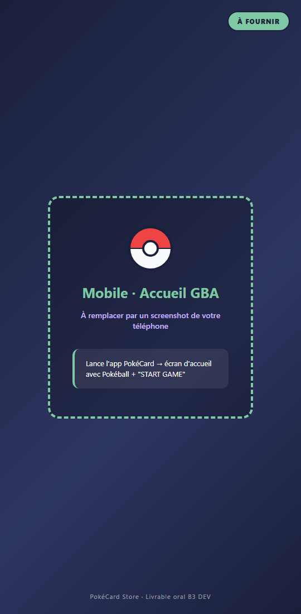

# Livrable final — PokéStore

**Formation :** UF DEV B3 — Ynov Informatique  
**Sujet :** Libre (équivalent Smart Café)  
**Équipe :** [Prénoms — promo]  
**Date :** Juin 2026

---

# 1. Introduction

PokéStore est une boutique en ligne de cartes Pokémon TCG (web + mobile + API). Le **panel admin Electron** est un **plus personnel** (non exigé par Ynov) pour gérer le catalogue.

## Livrables Ynov — conformité

| Exigence PDF | Réalisé | Preuve |
|--------------|---------|--------|
| Application web | Oui | https://pokestore-hazel.vercel.app |
| Backend sécurisé | Oui | NestJS — JWT, guards, helmet, throttler, rôle ADMIN |
| Base SQL | Oui | PostgreSQL Neon + Prisma |
| Application mobile | Oui | `mobile-rn/` Expo + APK EAS |
| Doc fonctionnelle + technique | Oui | Ce document + CDC + Swagger |

---

# 2. Documentation fonctionnelle

## 2.1 Parcours client

Accueil → Boutique → Filtres → Panier → Connexion (email / Google) → Stripe → Commandes / Collection / Contact.

## 2.2 Application web

Boutique, auth, panier, Stripe, commandes, collection, profil, contact (captcha), SEO.

## 2.3 Application mobile

Mêmes fonctions principales : boutique, auth, panier, Stripe, commandes, collection, contact.

## 2.4 Panel admin Electron (bonus)

- **Dashboard** : ventes payées, CA, graphique 6 mois, produit le plus vendu  
- **Pokemon Cards** : import API TCG, édition inline, export CSV (113+ cartes)  
- **Orders** : suivi des commandes (PENDING / PAID)  
- **Connexion réservée** : `POST /api/auth/admin/login` — rôle **ADMIN** uniquement  
- Compte admin : `admin@pokemon.local` (voir `npm run db:seed:admin`)  
- Installateur Windows : `npm run make` dans `pokemon-electron/`

## 2.5 Contact

Captcha HMAC + honeypot + rate limit. Emails prod via **Resend**.

---

# 3. Documentation technique

## 3.1 Architecture

Site web + mobile + Electron → API NestJS (Render) → PostgreSQL (Neon).

## 3.2 Stack

React 19, NestJS 11, Prisma, Expo 54, Electron, Vercel, Render, Stripe, Resend.

## 3.3 Modèle de données

User (role USER | ADMIN), PokemonCard, Cart, Order, Favorite — relations Prisma.

## 3.4 API

Swagger : `/api/docs`. Routes publiques : catalogue, contact, auth client. Routes protégées JWT : panier, commandes. Routes **admin** : `GET /cards/import`, `GET /cards/reprice`.

## 3.5 Sécurité

| Mesure | Statut |
|--------|--------|
| bcrypt + JWT + guards | Oui |
| Google OAuth (clients) | Oui |
| Rôle ADMIN + route admin/login | Oui |
| Captcha contact | Oui |
| CORS restreint | Oui |
| **Helmet** (headers HTTP) | Oui |
| **Throttler** global | Oui (120 req/min ; login 15/min) |
| **Routes import/reprice** | Oui (JWT + AdminGuard) |
| Webhook Stripe | Exclu du throttler |

## 3.6 Accessibilité et performances

PageSpeed desktop : perf 99, a11y 98. Mobile : perf 83, a11y 98.

## 3.7 Déploiement

Vercel (front), Render (API), Neon (BDD), EAS (APK).

---

# 4. Tests

- **Jest** : 7 tests backend — 100 % passés  
- **Playwright** : 7 scénarios E2E — captures dans `docs/tests/`

---

# 5. Captures

## Web

## Mobile — à compléter

## Admin Electron

**Dashboard** — statistiques ventes et graphique mensuel :

**Pokemon Cards** — catalogue, import et édition :

**Commandes** — liste des orders (emails masqués sur la capture) :

## PageSpeed

---

# 6. Oral (20 min)

Démo web → mobile → **Electron admin** (dashboard, cartes, commandes) → sécurité (JWT, ADMIN, helmet) → tests → limites éventuelles.

---

*PokéStore — UF DEV B3 — Juin 2026*
