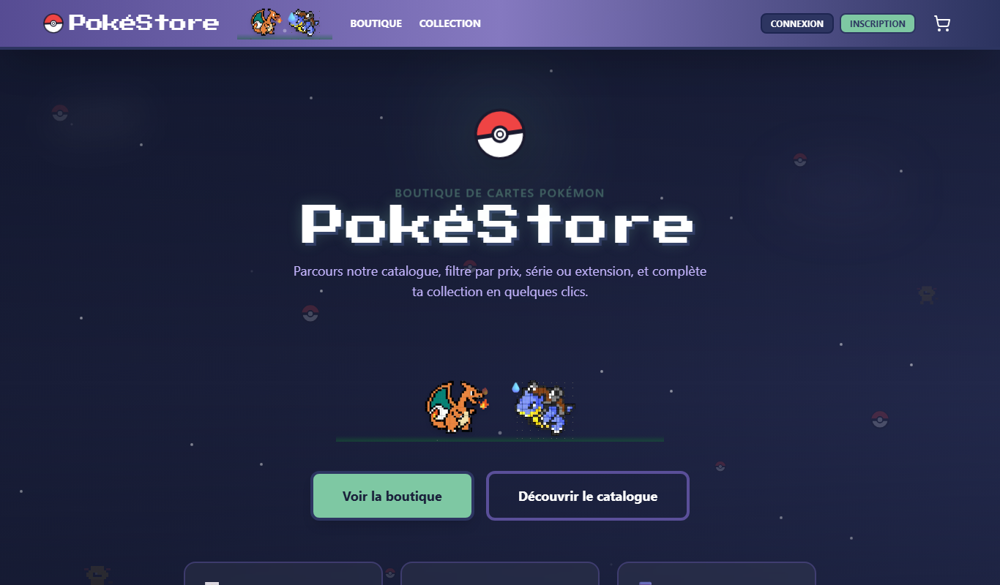
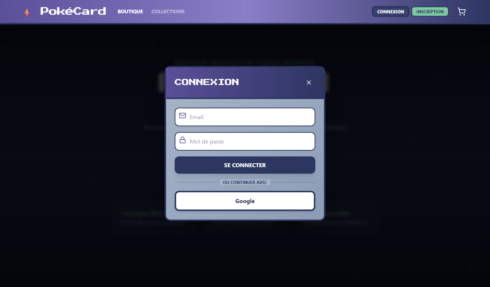
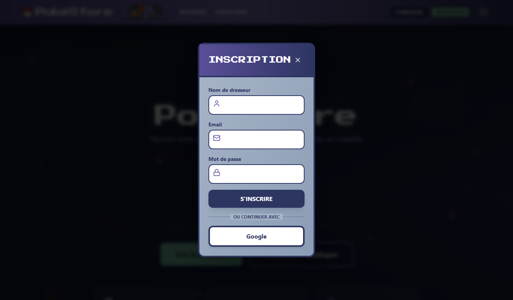
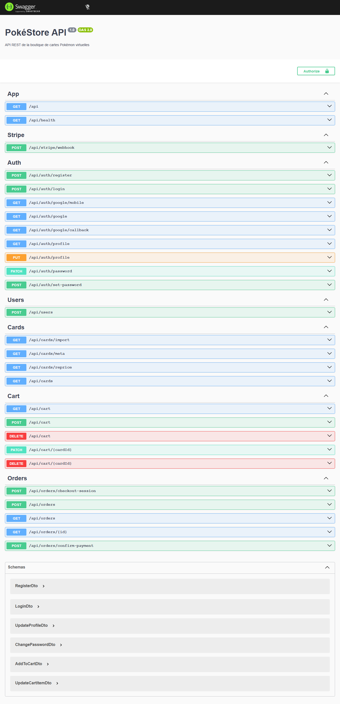
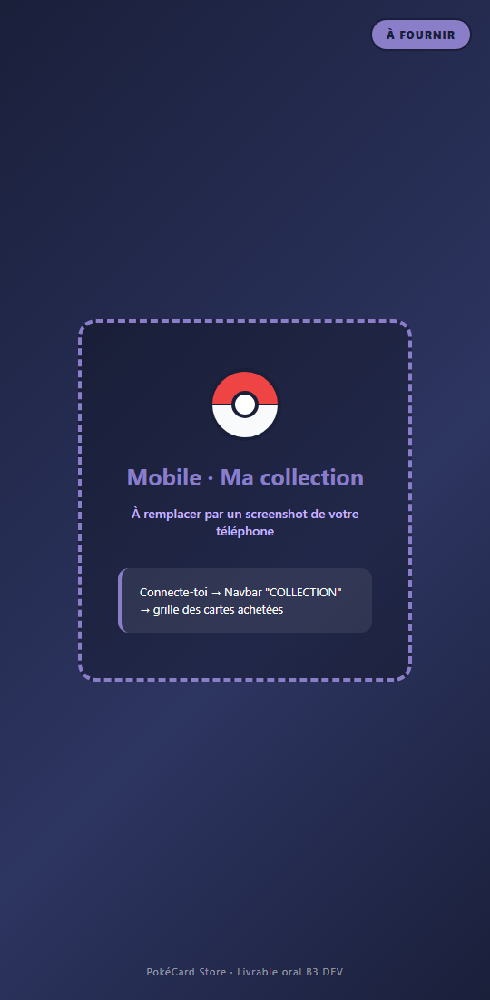
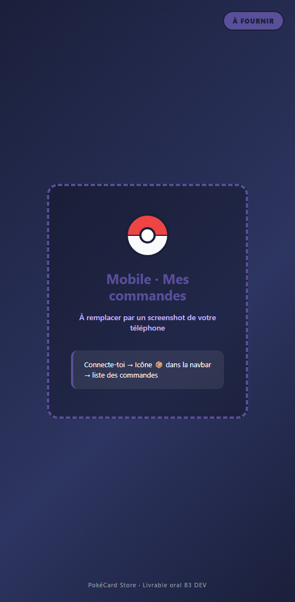
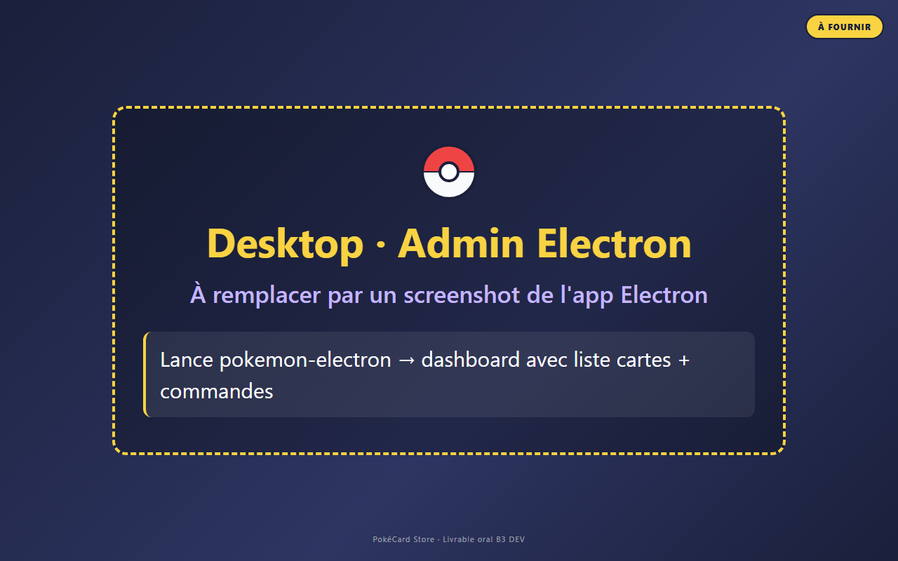

# Livrable final — PokéCard Store

**Projet :** UF DEV B3 — Ynov Informatique (sujet libre)  
**Équipe :** [À compléter : prénoms, promo]  
**Date :** Juin 2026  
**Auteur du document :** Documentation de synthèse pour l’oral final (20 min)

---

## Résumé exécutif

**PokéCard Store** est une plateforme e-commerce de cartes Pokémon TCG comprenant :

| Brique | Technologie | URL / accès |
|--------|-------------|-------------|
| **Site web** | React 19, Vite, Tailwind | https://pokestore-hazel.vercel.app |
| **API backend** | NestJS 11, Prisma, PostgreSQL (Neon) | https://pokestore-api-btz1.onrender.com/api |
| **Doc API** | Swagger | https://pokestore-api-btz1.onrender.com/api/docs |
| **App mobile Android** | React Native, Expo SDK 54 (APK EAS) | Installable via build EAS |
| **Outil admin desktop** | Electron (hors dépôt ou local) | Mise à jour cartes + consultation commandes |

Le projet répond au **sujet libre** du PDF UF DEV B3 : application web + backend sécurisé + base SQL + application mobile + documentation fonctionnelle et technique.

---

## 1. Conformité au cahier des charges Ynov (UF_DEV_B3)

Référence : document officiel *UF DEV B3* — évaluation sur les mêmes compétences que le sujet Smart Café.

### 1.1 Livrables obligatoires (sujet libre)

| Livrable PDF | Statut | Preuve dans le projet |
|--------------|--------|------------------------|
| Application web | ✅ Réalisé | `frontend/` — boutique, auth, panier, commandes |
| Backend structuré et sécurisé | ✅ Réalisé | `backend/` — NestJS modules, JWT, guards, validation DTO |
| Base de données SQL | ✅ Réalisé | PostgreSQL + Prisma (`backend/prisma/schema.prisma`) |
| Application mobile Android/iOS | ✅ Réalisé | `mobile-rn/` — APK EAS + Expo Go |
| Documentation fonctionnelle et technique | ✅ Réalisé | Ce document + `docs/cahier-des-charges/` + `README.md` |

### 1.2 Grille de compétences techniques

| Compétence | Niveau estimé | Justification |
|------------|---------------|---------------|
| Application web framework moderne | **Acquis → Maîtrisé** | React 19 + Vite, composants typés, services API |
| UI multi-supports (desktop, tablette, mobile) | **Acquis** | Tailwind responsive, menu hamburger, app mobile native |
| Accessibilité | **Partiellement acquis** | `aria-label` sur icônes/modales, contrastes à auditer Lighthouse |
| Performances frontend | **Partiellement acquis** | Lazy-loading images, pagination API ; audit Lighthouse à formaliser |
| Feedbacks utilisateur (toasts, loaders, erreurs) | **Acquis** | `react-hot-toast`, spinners, messages d’erreur dans modales |
| Architecture backend orientée services | **Maîtrisé** | Controllers / Services / Modules NestJS |
| Auth & autorisation sécurisés | **Acquis** | JWT, bcrypt, Google OAuth, guards sur routes protégées |
| Protection endpoints | **Partiellement acquis** | Validation DTO ; CORS ouvert, pas de helmet/throttler |
| Modèle de données relationnel | **Acquis** | User, Cart, Order, PokemonCard, Favorite |
| Requêtes SQL via ORM | **Acquis** | Prisma Client, migrations, index sur filtres boutique |
| Application mobile native | **Acquis** | Expo RN : auth, boutique, panier, Stripe, collection |
| Versionnement Git | **Acquis** | Dépôt GitHub |
| Documentation | **Acquis** | Cahier des charges MD/HTML/PDF, README, Swagger |
| Présentation orale | **À préparer** | Voir section 14 de ce document |

### 1.3 Points non couverts ou à renforcer (honnêteté pour le jury)

| Point | Statut | Action recommandée |
|-------|--------|-------------------|
| Tests E2E Playwright | ✅ Implémentés (7 tests passés) | Voir section 7.2 |
| Formulaire contact par email | ❌ Non fonctionnel | À implémenter post-soutenance |
| CORS restreint + helmet + rate limiting | ❌ Partiel | `task.md` — tâches listées |
| Audit Lighthouse documenté | ❌ Non formalisé | Lancer Chrome Lighthouse et capturer résultats |
| App Electron dans le dépôt Git | ⚠️ Non visible | Documenter le lien repo ou ajouter `desktop/` au monorepo |

---

## 2. Vision produit

### 2.1 Problématique métier

Les collectionneurs de cartes Pokémon TCG ont besoin d’un **catalogue filtrable**, d’un **parcours d’achat sécurisé** et d’un **suivi de collection** accessible sur web et mobile.

### 2.2 Cibles utilisateurs

- **Collectionneur** : filtre par prix, série, set, rareté, type
- **Acheteur** : panier, paiement Stripe, historique commandes
- **Administrateur** : import/sync cartes, repricing, suivi commandes (outil desktop)

### 2.3 Parcours utilisateur de référence

```
Accueil → Boutique → Filtres / recherche → Détail carte → Panier
    → Connexion (email ou Google) → Paiement Stripe → Commandes / Collection
```

---

## 3. Documentation fonctionnelle

### 3.1 Application web (`frontend/`)

| Fonctionnalité | Description | Statut |
|----------------|-------------|--------|
| Page d’accueil | Hero, CTA boutique, cartes avantages | ✅ |
| Catalogue boutique | Pagination, filtres (prix, année, série, set, recherche) | ✅ |
| Détail carte | Modal avec effets visuels (canvas Three.js) | ✅ |
| Inscription / connexion | Email + mot de passe | ✅ |
| Connexion Google | OAuth redirect web | ✅ |
| Panier | Ajout, quantités, suppression | ✅ |
| Paiement Stripe | Checkout redirect + retour | ✅ |
| Mes commandes | Liste + détail articles | ✅ |
| Profil utilisateur | Modification nom / mot de passe | ✅ |
| Collection (galerie) | Lien navbar désactivé (grisé) | ⚠️ Web : via commandes uniquement |
| SEO | Meta dynamiques, OG, JSON-LD, sitemap | ✅ |
| Contact | — | ❌ À faire |

### 3.2 Application mobile (`mobile-rn/`)

| Fonctionnalité | Description | Statut |
|----------------|-------------|--------|
| Écran d’accueil GBA | Pokéball animée, « START GAME » | ✅ |
| Boutique | Grille, filtres, pagination | ✅ |
| Détail carte | Effets type (WebView canvas) + tilt 3D | ✅ |
| Inscription / connexion email | JWT persisté (AsyncStorage) | ✅ |
| Connexion Google | OAuth via navigateur in-app | ✅ |
| Panier + Stripe | Checkout + confirmation | ✅ |
| Mes commandes | Liste expandable | ✅ |
| Ma collection | Grille des cartes achetées (commandes PAID) | ✅ |
| APK standalone | Build EAS preview (Android) | ✅ |

### 3.3 Outil administrateur desktop (Electron)

> **Note :** L’application Electron n’est **pas présente dans le dépôt `pokemon-app` analysé**. Si elle existe en local ou dans un autre repo, ajouter le lien GitHub dans ce document.

Fonctions attendues côté admin (alignées sur l’API existante) :

| Action admin | Endpoint / script | Description |
|--------------|-------------------|-------------|
| Importer des cartes | `GET /api/cards/import?sets=sv1&limit=100` | Sync depuis API Pokémon TCG |
| Recalculer les prix | `GET /api/cards/reprice` ou `npm run db:reprice` | Grille de prix par rareté |
| Consulter commandes | `GET /api/orders` (JWT admin) | Liste des commandes utilisateurs |
| Seed initial | `npm run db:seed` | Peuplement BDD |

### 3.4 Emails

| Type | Statut | Détail |
|------|--------|--------|
| Email de bienvenue (inscription) | ⚠️ Code présent | Envoi async ; dépend de `MAIL_*` sur Render |
| Email confirmation commande | ⚠️ Code présent | Après paiement Stripe confirmé |
| Formulaire contact site | ❌ Non implémenté | **À faire après la soutenance** |

---

## 4. Documentation technique

### 4.1 Architecture globale

```
┌─────────────────┐     ┌─────────────────┐     ┌──────────────────┐
│  Frontend Web   │     │   Mobile RN     │     │  Admin Electron  │
│  React + Vite   │     │  Expo SDK 54    │     │  (hors repo)     │
└────────┬────────┘     └────────┬────────┘     └────────┬─────────┘
         │                       │                        │
         └───────────────────────┼────────────────────────┘
                                 │ HTTPS / REST
                                 ▼
                    ┌────────────────────────┐
                    │   API NestJS (Render)  │
                    │   /api/*  +  Swagger   │
                    └────────────┬───────────┘
                                 │ Prisma ORM
                                 ▼
                    ┌────────────────────────┐
                    │  PostgreSQL (Neon)     │
                    └────────────────────────┘
         ┌───────────────────────┴───────────────────────┐
         ▼                       ▼                       ▼
   Google OAuth            Stripe Checkout          SMTP (nodemailer)
```

### 4.2 Stack technique

| Couche | Technologies |
|--------|--------------|
| Frontend | React 19, TypeScript, Vite 7, Tailwind CSS 3, react-helmet-async, react-hot-toast, Three.js |
| Backend | NestJS 11, Prisma 6, PostgreSQL, Passport JWT, Stripe, Nodemailer |
| Mobile | React Native 0.81, Expo 54, React Navigation, WebView (effets cartes) |
| Infra | Vercel (front), Render (API), Neon (BDD), EAS Build (APK) |

### 4.3 Modèle de données (entités principales)

```
User ──┬── Cart ── CartItem ── PokemonCard
       ├── Order ── OrderItem ── PokemonCard
       └── Favorite ── PokemonCard
```

**Statuts commande :** `PENDING` | `PAID` | `CANCELLED`

### 4.4 Endpoints API principaux

| Méthode | Route | Auth | Rôle |
|---------|-------|------|------|
| POST | `/api/auth/register` | — | Inscription |
| POST | `/api/auth/login` | — | Connexion |
| GET | `/api/auth/google` | — | OAuth Google (web) |
| GET | `/api/auth/google/mobile` | — | OAuth Google (mobile) |
| GET | `/api/cards` | — | Catalogue filtré + pagination |
| GET | `/api/cards/meta` | — | Filtres dynamiques (séries, sets…) |
| GET | `/api/cards/import` | — | Import cartes (admin) |
| GET | `/api/cards/reprice` | — | Recalcul prix (admin) |
| GET/POST/PATCH/DELETE | `/api/cart/*` | JWT | Panier |
| POST | `/api/orders/checkout-session` | JWT | Session Stripe |
| POST | `/api/orders/confirm-payment` | JWT | Confirmation paiement |
| GET | `/api/orders` | JWT | Historique commandes |

Documentation interactive complète : **/api/docs**

### 4.5 Structure du dépôt

```
pokemon-app/
├── backend/           # API NestJS + Prisma + Stripe + Mail
├── frontend/          # Site web React
├── mobile-rn/         # App mobile Expo (principale)
├── mobile/            # Ancien wrapper Capacitor (non utilisé)
├── docs/
│   ├── cahier-des-charges/   # CDC MD, HTML, PDF + captures
│   └── LIVRABLE_ORAL_FINAL.md  # Ce document
├── README.md
├── task.md            # Grille validation Ynov
├── mise_en_place_seo.md
└── DEPLOY.md
```

### 4.6 Variables d’environnement

Voir `backend/.env.example`, `frontend/.env.example`, `mobile-rn/.env.example`.

Variables critiques en production :
- `DATABASE_URL`, `JWT_SECRET`, `FRONTEND_URL`
- `GOOGLE_CLIENT_ID`, `GOOGLE_CLIENT_SECRET`, `GOOGLE_CALLBACK_URL`
- `STRIPE_SECRET_KEY`, `STRIPE_WEBHOOK_SECRET`
- `MAIL_HOST`, `MAIL_USER`, `MAIL_PASS`, `MAIL_FROM`

---

## 5. SEO (référence : `mise_en_place_seo.md`)

### 5.1 Implémentation

| Élément | Fichier | Détail |
|---------|---------|--------|
| Composant SEO réutilisable | `frontend/src/components/SEO.tsx` | title, description, canonical, OG, Twitter, JSON-LD |
| HelmetProvider | `frontend/src/main.tsx` | Activation react-helmet-async |
| Fallback statique | `frontend/index.html` | `lang="fr"`, meta de base |
| Page accueil | `HomePage.tsx` | Schema `WebSite` |
| Page boutique | `Shop.tsx` | Schema `ItemList` dynamique (produits) |
| robots.txt | `frontend/public/robots.txt` | Allow /, Disallow /api/ |
| sitemap.xml | `frontend/public/sitemap.xml` | URLs / et /shop |

### 5.2 URLs de production SEO

> **À mettre à jour** : le sitemap et certains JSON-LD référencent encore `pokecardstore.com`. En production réelle, utiliser `https://pokestore-hazel.vercel.app`.

### 5.3 Vérification

1. DevTools → Elements → `<head>` : titre dynamique par page
2. [Google Rich Results Test](https://search.google.com/test/rich-results)
3. [Facebook Sharing Debugger](https://developers.facebook.com/tools/debug/)

---

## 6. Sécurité

| Mesure | Implémenté | Détail |
|--------|----------|--------|
| Hash mot de passe (bcrypt) | ✅ | `auth.service.ts` |
| JWT + expiration | ✅ | Guards sur cart, orders, profile |
| Google OAuth | ✅ | Passport strategy |
| Validation DTO (class-validator) | ✅ | Register, login, checkout |
| Stripe webhook signature | ✅ | `rawBody: true` dans main.ts |
| CORS restreint | ❌ | `origin: true` (tous domaines) |
| Helmet (headers HTTP) | ❌ | Prévu dans `task.md` |
| Rate limiting (throttler) | ❌ | Prévu dans `task.md` |
| Routes admin protégées | ❌ | `/cards/import` et `/reprice` publiques |

---

## 7. Tests et qualité

### 7.1 Tests unitaires backend (Jest)

**Résultat :** ✅ **3 suites — 7 tests — 100 % passés**

```
PASS src/app.controller.spec.ts
PASS src/cards/cards.service.spec.ts
PASS src/cards/cards.controller.spec.ts

Test Suites: 3 passed, 3 total
Tests:       7 passed, 7 total
Time:        ~2 s
```

| Fichier | Tests |
|---------|-------|
| `backend/src/app.controller.spec.ts` | Health check controller |
| `backend/src/cards/cards.service.spec.ts` | Définition + `findCards` + `getShopMeta` (mocks Prisma & Config) |
| `backend/src/cards/cards.controller.spec.ts` | Définition + `GET /cards` + `GET /cards/meta` (mock service) |

Commande : `cd backend && npm run test`


### 7.2 Tests E2E Playwright

**Résultat :** ✅ **7 scénarios — 100 % passés** sur le site déployé en production (`pokestore-hazel.vercel.app`) et l'API (`pokestore-api-btz1.onrender.com`).

Commande : `cd frontend && npx playwright test`

Rapport HTML interactif : `docs/tests/playwright-report/index.html`

| # | Scénario | Cible | Capture |
|---|----------|-------|---------|
| E2E-01 | Accueil charge et affiche le titre | Vercel | `e2e-01-home.png` |
| E2E-02 | Navigation vers la boutique | Vercel | `e2e-02-shop.png` |
| E2E-03 | Filtres boutique disponibles | Vercel | `e2e-03-filters.png` |
| E2E-04 | Modal connexion accessible | Vercel | `e2e-04-login-modal.png` |
| E2E-05 | Modal inscription accessible | Vercel | `e2e-05-signup-modal.png` |
| E2E-06 | Documentation Swagger accessible | Render | `e2e-06-swagger.png` |
| E2E-07 | Capture rendu sortie Jest | Local | `tests-unitaires-jest.png` |

#### Configuration Playwright

Fichier `frontend/playwright.config.ts` :

- `baseURL` : `https://pokestore-hazel.vercel.app`
- Navigateur : Chromium (Desktop Chrome, 1366×800)
- Timeouts adaptés au cold start Render (jusqu'à 180 s)
- Reporter HTML généré dans `docs/tests/playwright-report/`

#### Captures Playwright

**E2E-01 — Accueil**



**E2E-02 — Boutique avec catalogue chargé**


**E2E-03 — Filtres dynamiques**


**E2E-04 — Modal connexion**



**E2E-05 — Modal inscription**



**E2E-06 — Documentation Swagger (API Render)**



### 7.3 Tests manuels mobile (checklist)

| # | Test | Résultat attendu |
|---|------|------------------|
| M-01 | Install APK / Expo Go | App s’ouvre sur écran GBA |
| M-02 | START GAME → Boutique | Catalogue charge (Render peut mettre ~30s au 1er appel) |
| M-03 | Connexion Google | Retour app connecté |
| M-04 | Ajout panier + Stripe | Paiement test 4242… → alerte succès |
| M-05 | Collection | Cartes achetées visibles en grille |
| M-06 | Mes commandes | Historique avec statut Payée |

---

## 8. Captures d’écran

Dossier source : `docs/cahier-des-charges/images/`

### 8.1 Accueil — desktop


### 8.2 Accueil — version mobile (viewport responsive)


### 8.3 Accueil — page complète (scroll)


### 8.4 Hero V2 — accueil refondu


### 8.5 Boutique avec filtres


### 8.6 Modal connexion


### 8.7 Modal inscription


## 8.8 Captures complémentaires mobile et desktop

> Les fichiers ci-dessous sont des **placeholders générés** : il suffit de les **écraser** par les vraies captures (mêmes noms, mêmes chemins) puis de régénérer le `.docx` pour qu'elles apparaissent automatiquement dans le livrable.

### Mobile — Accueil GBA


### Mobile — Ma collection



### Mobile — Mes commandes



### Desktop — Outil admin Electron



### Comment remplacer les placeholders

| Fichier à fournir | Chemin exact | Comment l'obtenir |
|-------------------|--------------|-------------------|
| `capture-mobile-home.png` | `docs/cahier-des-charges/images/` | Screenshot téléphone — écran d'accueil GBA |
| `capture-mobile-collection.png` | `docs/cahier-des-charges/images/` | Connecté → navbar "COLLECTION" |
| `capture-mobile-orders.png` | `docs/cahier-des-charges/images/` | Connecté → icône 📦 navbar |
| `capture-admin-electron.png` | `docs/cahier-des-charges/images/` | App `pokemon-electron` — dashboard |

Puis : `cd docs && pandoc LIVRABLE_ORAL_FINAL.md -o LIVRABLE_ORAL_FINAL.docx --toc --toc-depth=2 --from gfm`

---

## 9. Déploiement

| Service | Hébergeur | URL |
|---------|-----------|-----|
| Frontend | Vercel | https://pokestore-hazel.vercel.app |
| API | Render (free tier) | https://pokestore-api-btz1.onrender.com |
| BDD | Neon PostgreSQL | (URL privée) |
| Mobile APK | EAS Build (Expo) | expo.dev → projet `@adlens/mobile-rn` |

**Limitation Render gratuit :** le serveur s’endort après inactivité → premier chargement lent (~30 s).

Guide détaillé : `DEPLOY.md`, `RENDER.md`

---

## 10. Guide de présentation orale (20 minutes)

### 10.1 Structure recommandée

| Durée | Partie | Contenu |
|-------|--------|---------|
| 2 min | Introduction | Contexte, sujet libre, équipe, démo live annoncée |
| 3 min | Problématique & cibles | Collectionneurs, parcours achat |
| 4 min | Architecture | Schéma web + mobile + API + BDD (section 4.1) |
| 5 min | **Démo live** | Accueil → boutique → filtre → panier → (Stripe si temps) |
| 3 min | Mobile | APK : GBA, collection, Google, Stripe |
| 2 min | Qualité & SEO | Swagger, toasts, SEO, tests (unitaires + plan Playwright) |
| 1 min | Limites & suite | Contact mail, sécurité CORS, Playwright à finaliser |

### 10.2 Messages clés pour le jury

1. **Sujet libre validé** : web + API + SQL + mobile + doc = critères PDF remplis.
2. **Même API** pour web et mobile → architecture cohérente.
3. **Paiement réel** via Stripe (mode test en démo).
4. **SEO production-grade** : meta dynamiques, JSON-LD, sitemap.
5. **Honnêteté** : contact mail et Playwright E2E = prochaines étapes.

### 10.3 Questions probables du jury

| Question | Réponse courte |
|----------|----------------|
| Pourquoi sujet libre et pas Smart Café ? | Même compétences, domaine e-commerce gaming plus adapté à nos intérêts |
| Comment sécurisez-vous l’API ? | JWT, bcrypt, guards, validation DTO ; helmet/throttler prévus |
| Différence web / mobile ? | Même backend ; mobile a écran GBA + collection en grille |
| Base de données ? | PostgreSQL relationnel, Prisma, migrations versionnées |
| Tests ? | Jest backend ; plan Playwright E2E documenté |
| Déploiement ? | Vercel + Render + Neon, gratuit pour prototype |

---

## 11. Évolutions post-soutenance

| Priorité | Tâche |
|----------|-------|
| 🔴 Haute | Formulaire contact + envoi email (`POST /api/contact`) |
| 🔴 Haute | Tests Playwright E2E + captures dans `docs/tests/` |
| 🟠 Moyenne | Sécuriser routes admin + CORS + helmet + throttler |
| 🟠 Moyenne | Corriger URLs SEO (sitemap → vercel.app) |
| 🟡 Basse | Page Collection web (navbar actuellement grisée) |
| 🟡 Basse | Ajouter app Electron au monorepo Git |

---

## 12. Index des documents du projet

| Document | Chemin | Rôle |
|----------|--------|------|
| README principal | `README.md` | Installation, scripts, endpoints |
| Cahier des charges | `docs/cahier-des-charges/CAHIER_DES_CHARGES_POKEMON_APP.md` | Spec fonctionnelle + captures |
| Cahier des charges PDF | `docs/cahier-des-charges/CAHIER_DES_CHARGES_POKEMON_APP.pdf` | Version imprimable |
| Grille Ynov | `task.md` | Checklist compétences |
| SEO | `mise_en_place_seo.md` | Détail implémentation SEO |
| Déploiement | `DEPLOY.md` | Vercel + Render |
| Mobile handoff | `mobile-rn/HANDOFF_UI_MOBILE.md` | Notes techniques mobile |
| **Ce livrable** | `docs/LIVRABLE_ORAL_FINAL.md` | Synthèse oral final |

---

## 13. Conversion Word

Pour générer un `.docx` à partir de ce Markdown :

1. Copier ce fichier dans Claude / ChatGPT avec la consigne : *« Convertis en document Word structuré avec table des matières »*
2. Ou utiliser [Pandoc](https://pandoc.org/) :
   ```bash
   pandoc docs/LIVRABLE_ORAL_FINAL.md -o docs/LIVRABLE_ORAL_FINAL.docx
   ```
3. Insérer manuellement les images depuis `docs/cahier-des-charges/images/`

---

*Document généré pour la soutenance UF DEV B3 — PokéCard Store — Juin 2026*
