**Projet :** PokéStore — plateforme e-commerce de cartes Pokémon TCG  
**Équipe :** [À compléter : prénoms, promo]  
**Date :** Juin 2026  
**Dépôt :** https://github.com/AdlenSouci/pokestore

---

# Résumé exécutif

**PokéStore** est une plateforme complète : site web, application mobile Android, API REST et outil d’administration desktop. Toutes les briques partagent la **même API** et la **même base PostgreSQL**.

| Brique | Technologie | Accès |
|--------|-------------|-------|
| Site web | React 19, Vite, Tailwind | https://pokestore-hazel.vercel.app |
| API | NestJS 11, Prisma, PostgreSQL (Neon) | https://pokestore-api-btz1.onrender.com/api |
| Documentation API | Swagger | https://pokestore-api-btz1.onrender.com/api/docs |
| Application mobile | React Native, Expo SDK 54 | APK EAS + Expo Go (`mobile-rn/`) |
| Admin desktop | Electron Forge + React (`pokemon-electron/`) | Installateur Windows `.exe` (local) |

---

# Présentation du projet

## Problématique

Les collectionneurs de cartes Pokémon TCG ont besoin d’un **catalogue riche et filtrable**, d’un **parcours d’achat en ligne sécurisé** (panier, paiement, historique) et d’un **suivi de leur collection** — accessible depuis un navigateur ou un téléphone.

## Cibles utilisateurs

- **Collectionneur** : parcourt le catalogue, filtre par prix / série / set / rareté / type, consulte le détail des cartes avec effets visuels.
- **Acheteur** : crée un compte, gère son panier, paie via Stripe, retrouve ses commandes et ses cartes achetées.
- **Administrateur** : synchronise le catalogue depuis l’API Pokémon TCG, ajuste les prix, suit les ventes et les commandes via l’app Electron.

## Parcours utilisateur principal

```
Accueil → Boutique → Filtres / recherche → Détail carte → Panier
    → Connexion (email ou Google) → Paiement Stripe → Commandes + Collection
    → (optionnel) Contact
```

---

# Documentation fonctionnelle

## Application web (`frontend/`)

| Fonctionnalité | Description | Statut |
|----------------|-------------|--------|
| Page d’accueil | Hero PokéStore, animation combat Pokémon, CTA boutique | ✅ |
| Navbar responsive | Menu hamburger mobile, combat animé desktop, icônes panier / profil / commandes | ✅ |
| Boutique `/shop` | Catalogue paginé, filtres dynamiques (prix, année, série, set, rareté, recherche) | ✅ |
| Détail carte | Modal plein écran, tilt 3D, effets canvas par type (feu, eau, électrik…) | ✅ |
| Inscription / connexion | Modal email + mot de passe, validation, toasts | ✅ |
| Connexion Google | OAuth redirect vers le site | ✅ |
| Panier | Ajout, modification quantités, suppression, checkout | ✅ |
| Paiement Stripe | Redirection Checkout + retour avec confirmation | ✅ |
| Mes commandes | Modal liste + détail des articles par commande | ✅ |
| Ma collection `/collection` | Grille des cartes issues des commandes **PAID**, badge quantité | ✅ |
| Profil | Modification nom, téléphone, mot de passe | ✅ |
| Contact `/contact` | Formulaire + captcha maison (HMAC), envoi email via API | ✅ |
| SEO | `react-helmet-async`, meta OG/Twitter, JSON-LD, `robots.txt`, `sitemap.xml` | ✅ |
| Accessibilité | `aria-label` sur boutons icônes, modales, focus visible | ✅ |
| Feedbacks UI | `react-hot-toast`, spinners de chargement, messages d’erreur inline | ✅ |

**Pages et routes web :** `/` (accueil), `/shop`, `/collection`, `/contact`.

## Application mobile (`mobile-rn/`)

| Fonctionnalité | Description | Statut |
|----------------|-------------|--------|
| Accueil | Branding PokéStore, animation combat, CTA boutique | ✅ |
| Navbar | Menu hamburger, panier, liens Collection / Commandes / Contact | ✅ |
| Boutique | Grille responsive, filtres, pagination, même API que le web | ✅ |
| Détail carte | Effets type via WebView canvas + tilt 3D | ✅ |
| Inscription / connexion | JWT stocké dans AsyncStorage | ✅ |
| Connexion Google | OAuth mobile (`/auth/google/mobile` → retour `pokestore://`) | ✅ |
| Panier + Stripe | Checkout WebBrowser + confirmation | ✅ |
| Mes commandes | Liste expandable, statuts PENDING / PAID / CANCELLED | ✅ |
| Ma collection | Grille cartes achetées (commandes payées), navigation vers détail | ✅ |
| Contact | Formulaire + captcha, même API que le web | ✅ |
| Fond d'écran IA | Génération depuis la collection | ❌ Pas fait |
| APK Android | Build EAS preview (`eas build --profile preview`) | ✅ |

**Écrans :** Home, Shop, CardDetail, Login, Register, Cart, Orders, Collection, Contact.

## Outil administrateur desktop (`pokemon-electron/`)

Application **Electron Forge + Vite + React**, installable en `.exe` Windows (`npm run make`).  
Dossier **local** (`.gitignore` — bonus personnel, non dans le dépôt Git principal).

| Module | Fonctionnalités |
|--------|-----------------|
| **Connexion admin** | `POST /api/auth/admin/login` — rôle `ADMIN` obligatoire (séparé du login client) |
| **Dashboard** | Ventes payées, CA total, commandes en relance, graphique 6 mois, produit le plus vendu |
| **Pokemon Cards** | Liste BDD, import API (`GET /api/cards/import`), édition inline, suppression, export CSV |
| **Clients** | Liste utilisateurs, création client |
| **Orders** | Liste commandes avec statut, mise à jour statut |
| **Pipeline** | Suivi clients par étape (kanban) |
| **Relances** | Clients / commandes à relancer |

Connexion prod : `POKEMON_APP_API_URL=https://pokestore-api-btz1.onrender.com/api` + `DATABASE_URL` Neon dans `.env`.

## Emails et notifications

| Type | Implémentation | Statut |
|------|----------------|--------|
| Bienvenue (inscription) | `MailService` — envoi asynchrone (non bloquant) | ✅ |
| Confirmation commande | Après webhook Stripe `checkout.session.completed` | ✅ |
| Formulaire contact | `POST /api/contact` + captcha HMAC + honeypot + rate limit IP | ✅ |
| Production Render | **Resend** (HTTPS) — SMTP port 587 bloqué sur plan gratuit | ✅ |

---

# Documentation technique

## Architecture globale

```
┌─────────────────┐     ┌─────────────────┐     ┌──────────────────────┐
│  Frontend Web   │     │   mobile-rn     │     │  pokemon-electron    │
│  React + Vite   │     │  Expo SDK 54    │     │  Admin desktop       │
└────────┬────────┘     └────────┬────────┘     └──────────┬───────────┘
         │                       │                           │
         │    HTTPS / REST       │         JWT admin + pg    │
         └───────────────────────┼───────────────────────────┘
                                 ▼
                    ┌────────────────────────────┐
                    │   API NestJS (Render)      │
                    │   /api/*  +  Swagger       │
                    └─────────────┬──────────────┘
                                  │ Prisma ORM
                                  ▼
                    ┌────────────────────────────┐
                    │   PostgreSQL (Neon)        │
                    └────────────────────────────┘
         ┌────────────────────────┼────────────────────────┐
         ▼                        ▼                        ▼
   Google OAuth              Stripe Checkout            Resend / SMTP
```

## Stack technique

| Couche | Technologies |
|--------|--------------|
| Frontend web | React 19, TypeScript, Vite, Tailwind CSS, react-helmet-async, react-hot-toast, Three.js (effets cartes) |
| Backend | NestJS 11, Prisma 6, PostgreSQL, Passport JWT, Stripe, Resend/Nodemailer, Helmet, Throttler |
| Mobile | React Native 0.81, Expo 54, React Navigation, AsyncStorage, expo-web-browser |
| Admin | Electron 41, Electron Forge, Vite, React, `pg` (accès direct Neon) |
| Infra | Vercel (front), Render (API), Neon (BDD), EAS Build (APK) |

## Modèle de données (Prisma)

```
User (role: USER | ADMIN)
  ├── Cart ── CartItem ── PokemonCard
  ├── Order ── OrderItem ── PokemonCard
  └── Favorite ── PokemonCard
```

**Entités principales :**

- `User` : email, mot de passe hashé (bcrypt), googleId, rôle `USER` ou `ADMIN`
- `PokemonCard` : pokemonId, name, type, rarity, imageUrl, price, tcgSetId, series, releaseYear
- `Cart` / `CartItem` : panier actif par utilisateur
- `Order` / `OrderItem` : statuts `PENDING`, `PAID`, `CANCELLED`

Schéma : `backend/prisma/schema.prisma`

## Endpoints API principaux

| Méthode | Route | Auth | Description |
|---------|-------|------|-------------|
| POST | `/api/auth/register` | — | Inscription |
| POST | `/api/auth/login` | — | Connexion client |
| POST | `/api/auth/admin/login` | — | Connexion admin (rôle ADMIN) |
| GET | `/api/auth/google` | — | OAuth Google web |
| GET | `/api/auth/google/mobile` | — | OAuth Google mobile |
| GET | `/api/auth/profile` | JWT | Profil |
| PUT | `/api/auth/profile` | JWT | Mise à jour profil |
| GET | `/api/cards` | — | Catalogue filtré + pagination |
| GET | `/api/cards/meta` | — | Métadonnées filtres |
| GET | `/api/cards/import` | JWT + ADMIN | Import Pokémon TCG API |
| GET | `/api/cards/reprice` | JWT + ADMIN | Recalcul prix par rareté |
| GET/POST/PATCH/DELETE | `/api/cart/*` | JWT | Panier |
| POST | `/api/orders/checkout-session` | JWT | Session Stripe |
| POST | `/api/orders/confirm-payment` | JWT | Confirmation paiement |
| GET | `/api/orders` | JWT | Historique commandes |
| GET | `/api/contact/captcha` | — | Challenge captcha |
| POST | `/api/contact` | — | Envoi message contact |
| POST | `/api/stripe/webhook` | Signature Stripe | Webhook paiement |

Liste complète et testable : **/api/docs**

## Structure du dépôt

```
pokemon-app/
├── backend/              # API NestJS + Prisma + Stripe + Mail + Contact
├── frontend/             # Site web React (Vercel)
├── mobile-rn/            # App mobile Expo (APK EAS)
├── pokemon-electron/     # Admin Electron (local, gitignored)
├── docs/
│   ├── LIVRABLE_ORAL_FINAL.md    # Ce document
│   ├── cahier-des-charges/       # CDC initial + captures
│   └── tests/                    # Captures Playwright + Jest
├── README.md
└── task.md               # Grille de validation interne
```

## Variables d'environnement

Fichiers modèles : `backend/.env.example`, `frontend/.env.example`, `mobile-rn/.env.example`, `pokemon-electron/.env.example`.

| Variable | Rôle |
|----------|------|
| `DATABASE_URL` | PostgreSQL (Neon en prod) |
| `JWT_SECRET` | Signature tokens |
| `FRONTEND_URL` | CORS + redirects OAuth |
| `GOOGLE_CLIENT_*` | OAuth Google |
| `STRIPE_SECRET_KEY` / `STRIPE_WEBHOOK_SECRET` | Paiement |
| `RESEND_API_KEY` / `RESEND_FROM` | Emails prod (Render) |
| `CONTACT_TO` | Destinataire formulaire contact |
| `ADMIN_EMAIL` / `ADMIN_PASSWORD` | Seed compte admin Electron |

## Installation locale (résumé)

```bash
# Backend
cd backend && npm install && cp .env.example .env
npx prisma migrate dev && npm run db:seed && npm run db:seed:admin
npm run start:dev    # → http://localhost:3000

# Frontend
cd frontend && npm install && cp .env.example .env
npm run dev          # → http://localhost:5173

# Mobile
cd mobile-rn && npm install && npm start

# Admin Electron
cd pokemon-electron && npm install && npm start
# Build exe : npm run make
```

---

# SEO

| Élément | Fichier |
|---------|---------|
| Composant SEO | `frontend/src/components/SEO.tsx` |
| Meta dynamiques | title, description, canonical, OG, Twitter, JSON-LD |
| robots.txt | `frontend/public/robots.txt` |
| sitemap.xml | `frontend/public/sitemap.xml` |

URL de production : `https://pokestore-hazel.vercel.app`

---

# Sécurité

| Mesure | Statut | Détail |
|--------|--------|--------|
| Hash bcrypt | ✅ | Mots de passe |
| JWT + expiration | ✅ | Routes panier, commandes, profil |
| Rôle `ADMIN` + `AdminGuard` | ✅ | Import / reprice / login admin |
| Google OAuth | ✅ | Web + mobile |
| Validation DTO | ✅ | class-validator sur les entrées |
| Stripe webhook signature | ✅ | `rawBody: true` |
| CORS restreint | ✅ | Vercel + localhost |
| Helmet | ✅ | Headers HTTP sécurisés |
| Throttler | ✅ | POST limités ; GET navigation libre ; webhook Stripe exempté |
| Captcha contact | ✅ | HMAC + honeypot + rate limit par IP |
| Routes admin protégées | ✅ | `GET /cards/import`, `GET /cards/reprice` |

---

# Tests et qualité

## Tests unitaires backend (Jest)

**Résultat :** 3 suites — **7 tests — 100 % passés**

```
PASS src/app.controller.spec.ts
PASS src/cards/cards.service.spec.ts
PASS src/cards/cards.controller.spec.ts
```

Commande : `cd backend && npm run test`

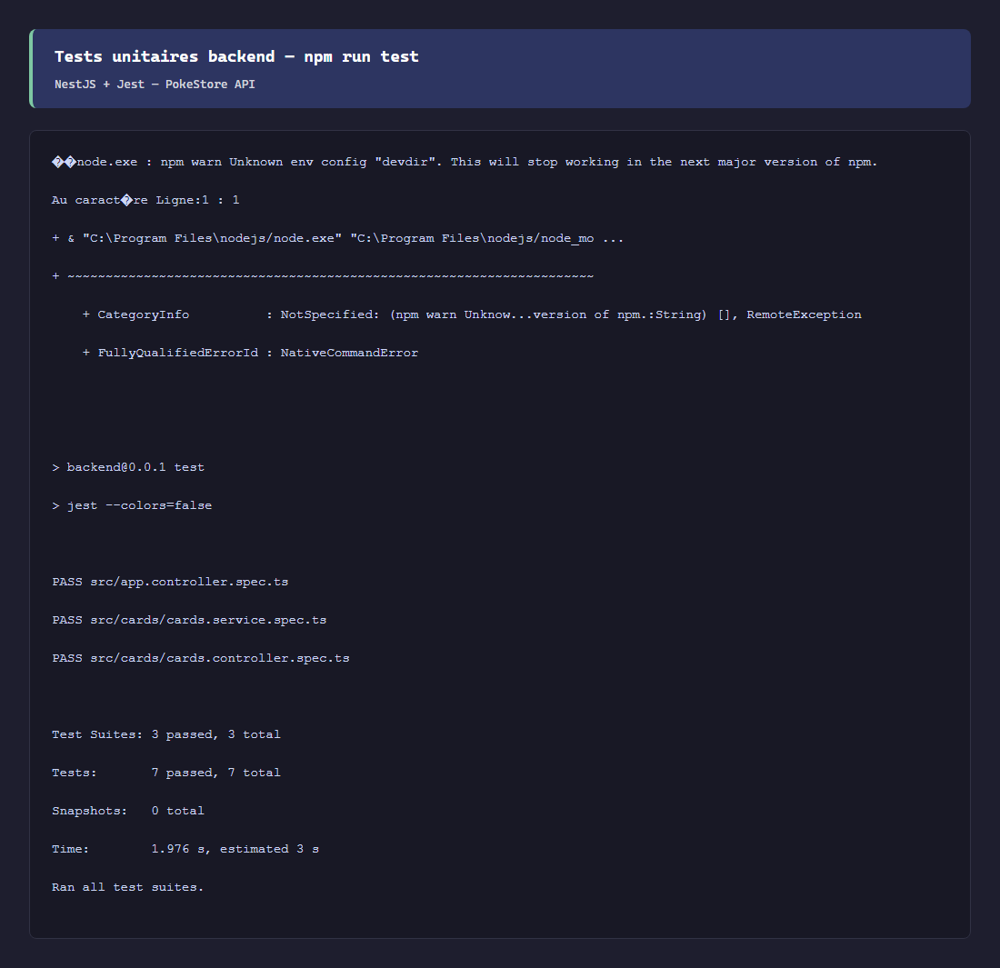

## Tests E2E Playwright

**Résultat :** **7 scénarios — 100 % passés** (prod Vercel + Render)

Commande : `cd frontend && npm run test:e2e`

| # | Scénario | Capture |
|---|----------|---------|
| 01 | Accueil | `e2e-01-home.png` |
| 02 | Boutique | `e2e-02-shop.png` |
| 03 | Filtres | `e2e-03-filters.png` |
| 04 | Modal connexion | `e2e-04-login-modal.png` |
| 05 | Modal inscription | `e2e-05-signup-modal.png` |
| 06 | Swagger API | `e2e-06-swagger.png` |

Rapport HTML : `docs/tests/playwright-report/index.html`

## Performances et accessibilité (PageSpeed)

| Plateforme | Performance | Accessibilité |
|------------|-------------|---------------|
| Desktop | 99 | 98 |
| Mobile | 83 | 98 |

Captures : `docs/cahier-des-charges/images/pagespeed-desktop-bureau.png`

## Tests manuels mobile (checklist)

| # | Test | Résultat attendu |
|---|------|------------------|
| M-01 | Expo Go / APK | App s’ouvre sur l’accueil |
| M-02 | Boutique | Catalogue charge (cold start Render ~30 s) |
| M-03 | Google OAuth | Retour app connecté |
| M-04 | Stripe test `4242…` | Commande PAID |
| M-05 | Collection | Grille cartes achetées |
| M-06 | Contact | Message envoyé |

---

# Captures d'écran

## Web — accueil et boutique


## Mobile

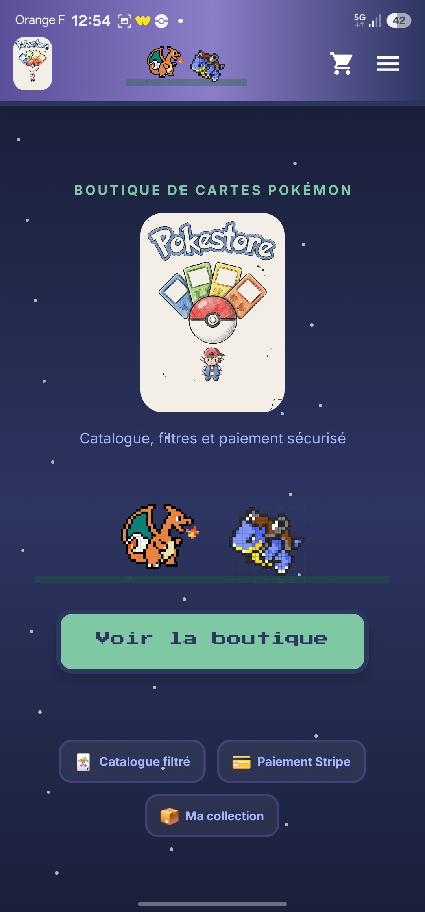

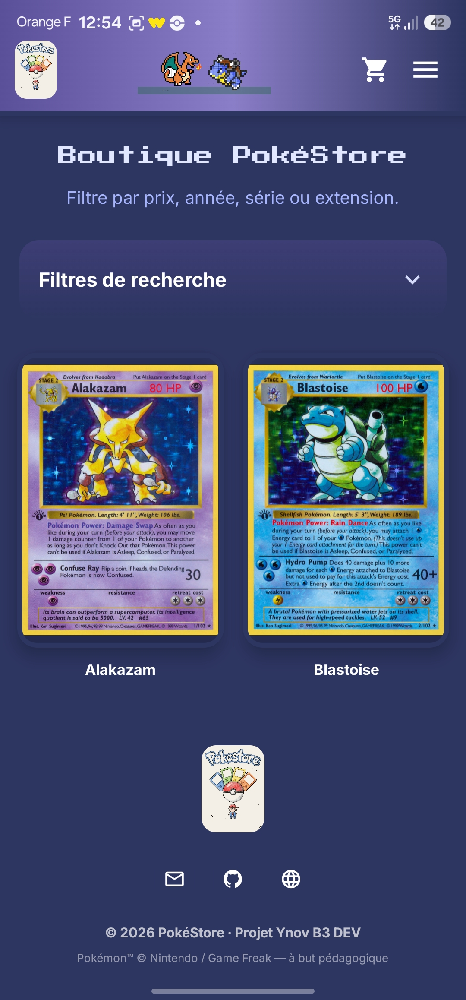

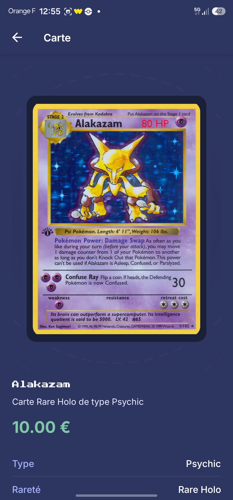

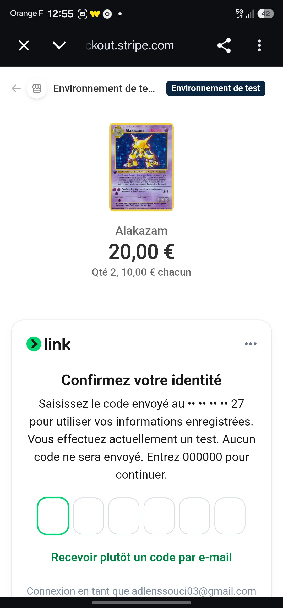

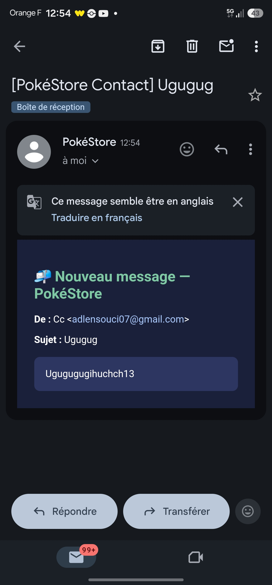

## Admin Electron

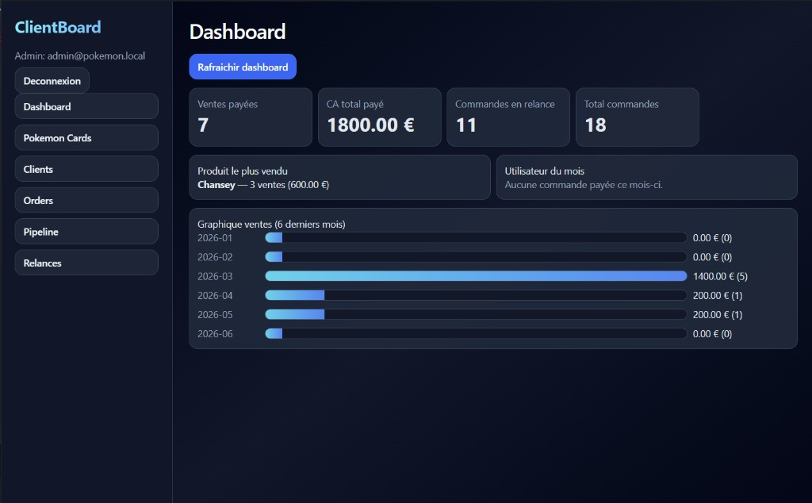

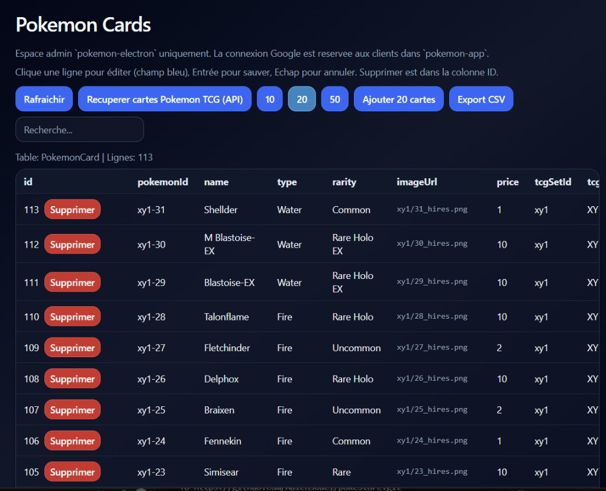

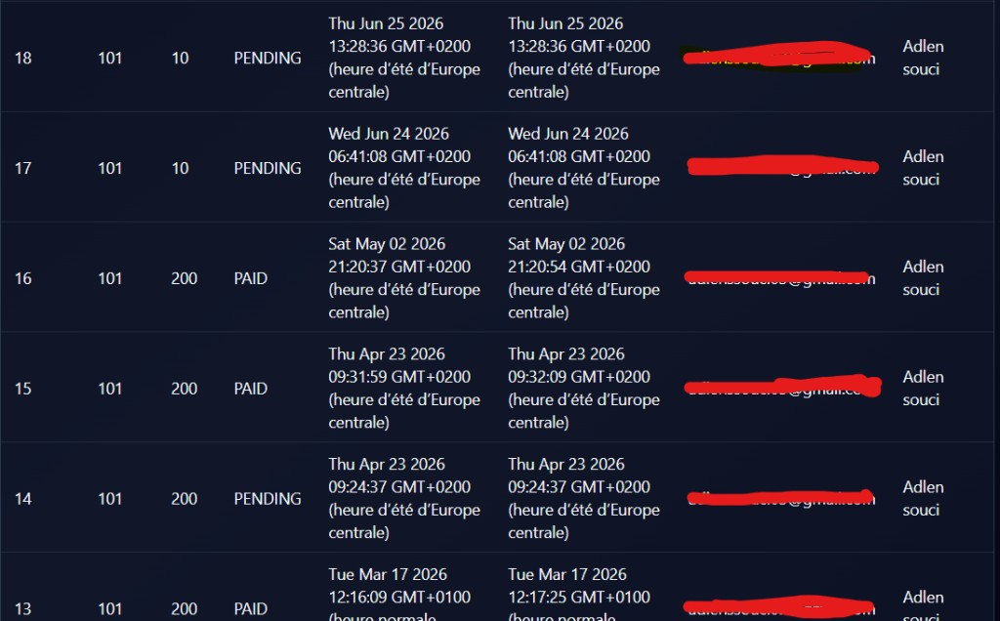

## PageSpeed desktop

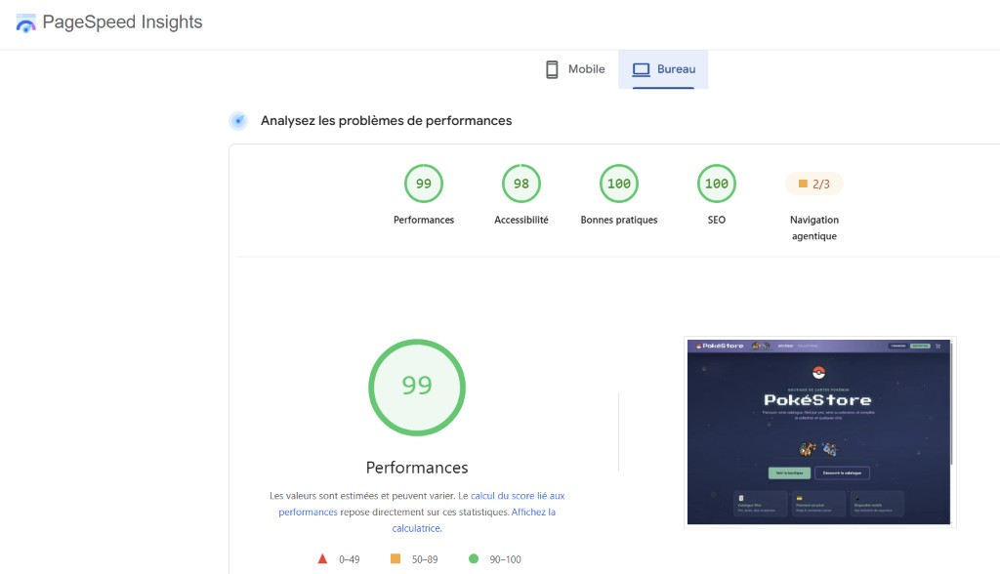

## Tests E2E (extraits)

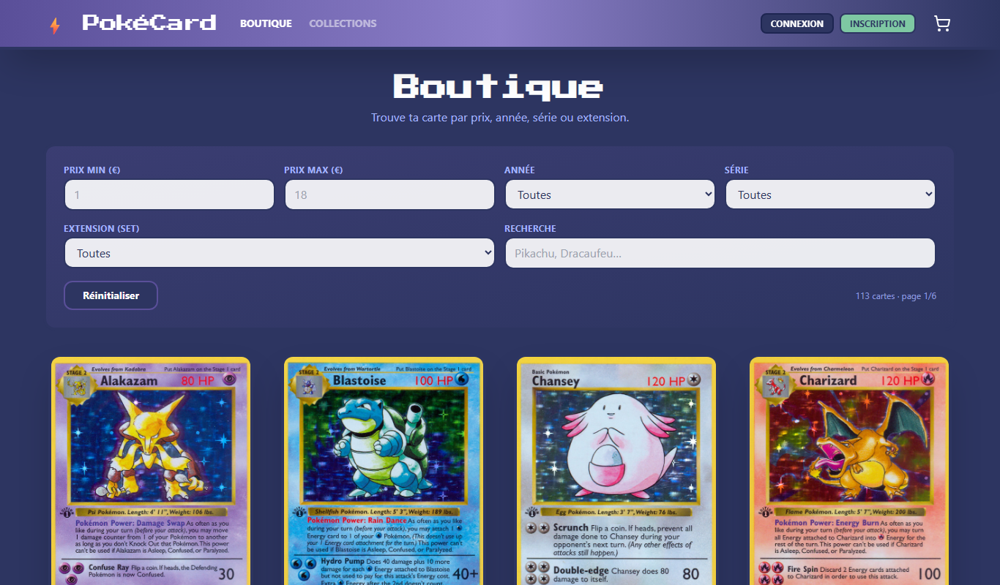

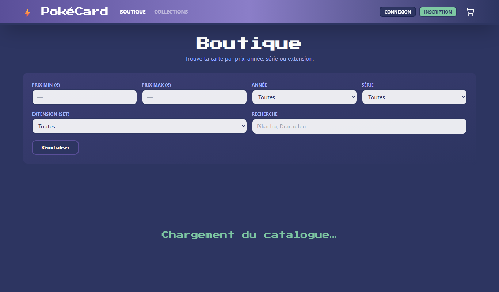

---

# Déploiement

| Service | Hébergeur | URL |
|---------|-----------|-----|
| Frontend | Vercel | https://pokestore-hazel.vercel.app |
| API | Render (free) | https://pokestore-api-btz1.onrender.com |
| Base de données | Neon PostgreSQL | URL privée |
| APK mobile | EAS Build (Expo) | expo.dev |
| Admin `.exe` | Build local | `pokemon-electron/out/make/` |

**Render gratuit :** cold start ~30–60 s après inactivité.

---

# Guide de présentation orale (20 min)

| Durée | Partie | Contenu |
|-------|--------|---------|
| 2 min | Introduction | PokéStore, équipe, architecture 3 clients + 1 API |
| 3 min | Parcours métier | Collectionneur → achat → suivi collection |
| 4 min | Démo web live | Accueil → boutique → filtre → panier → collection |
| 3 min | Démo mobile | Expo Go : boutique, Google, commandes, collection |
| 3 min | Admin Electron | Dashboard, import cartes, commandes (bonus) |
| 3 min | Technique | Prisma, JWT, ADMIN, Helmet, Swagger, tests Jest + Playwright |
| 2 min | Bilan | Ce qui est en prod, limites Render, évolutions |

### Messages clés

1. **Une API, trois clients** (web, mobile, admin).
2. **Paiement Stripe** fonctionnel (mode test en démo).
3. **Sécurité** : JWT, rôles, guards admin, helmet, throttler.
4. **Qualité** : 7 tests Jest + 7 E2E Playwright + PageSpeed documenté.

---

# Perspectives d'évolution

| Priorité | Fonctionnalité | Statut |
|----------|----------------|--------|
| — | Fond d'écran IA (mobile) | Pas fait (quota Gemini) |
| Moyenne | Fond d'écran IA avec API payante | Plus tard |
| Basse | Favoris utilisateur (modèle Prisma déjà présent) |
| Basse | Publier `pokemon-electron` dans le dépôt Git |

---

# Index des documents

| Document | Chemin |
|----------|--------|
| README installation | `README.md` |
| **Ce livrable** | `docs/LIVRABLE_ORAL_FINAL.md` |
| Grille interne | `task.md` |
| SEO | `mise_en_place_seo.md` |
| Captures tests | `docs/tests/` |
| Guide admin Electron | `pokemon-electron/ADMIN_PANEL_GUIDE.md` |

---

*PokéStore — Livrable final — Juin 2026*
