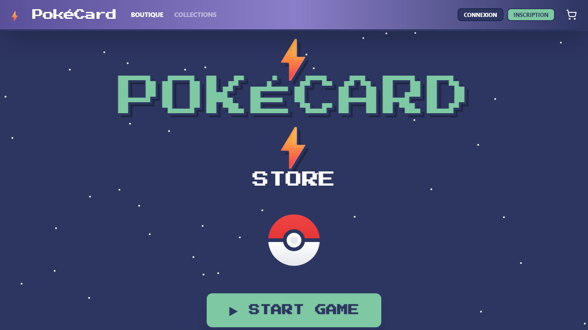
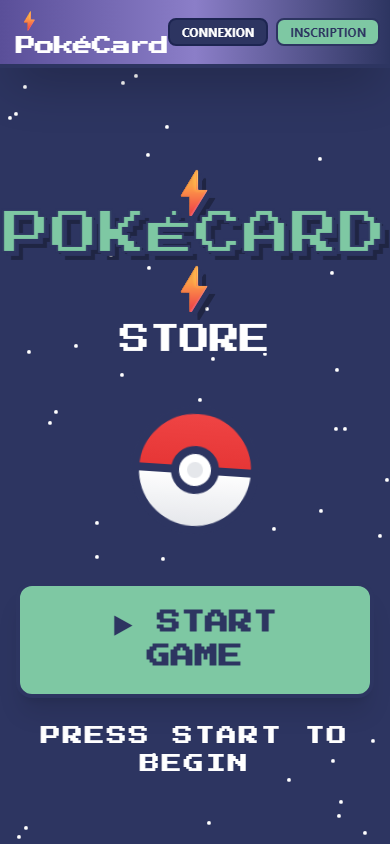
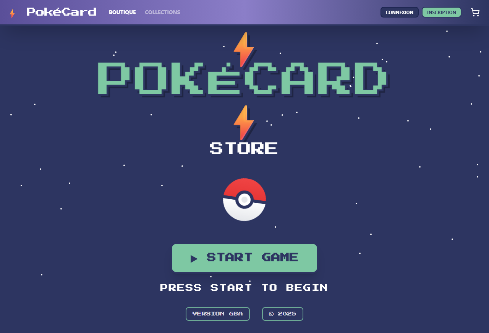
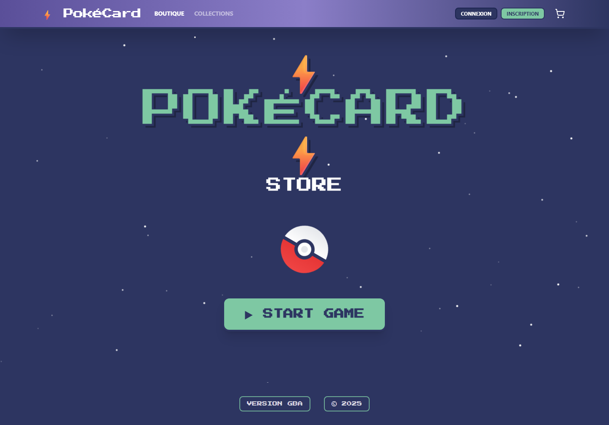
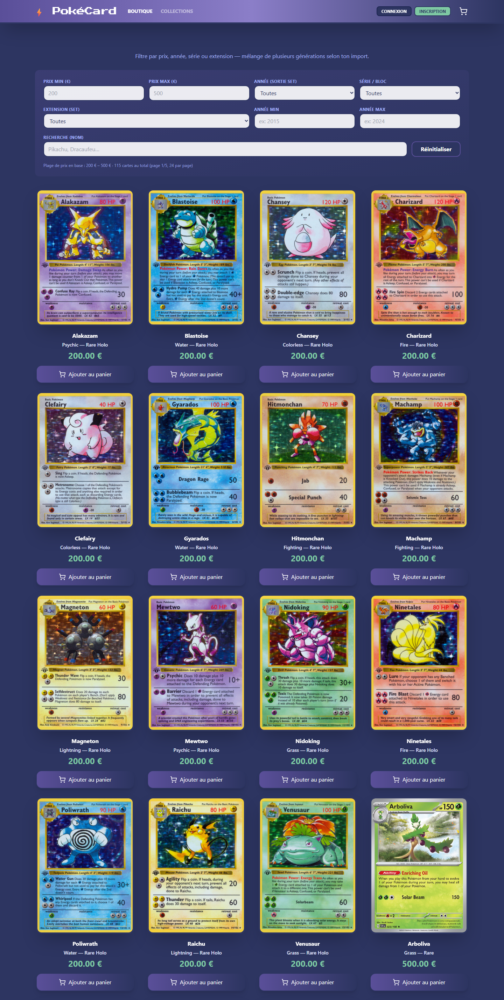

# Cahier des charges - Pokemon App

Version unique de reference (commune a la version MD, HTML et PDF).

## 1) Resume executif

`Pokemon App` est une plateforme de collection et d'achat de cartes TCG avec une experience immersive.
Le produit est compose de trois briques:
- interface web (`frontend`),
- API metier (`backend`),
- application mobile (`mobile-rn`).

Objectif principal: proposer un parcours utilisateur complet, fluide et securise, de la decouverte des cartes jusqu'au paiement et au suivi de commande.

## 2) Contexte et vision

Le projet s'inscrit dans une logique produit "gaming + e-commerce":
- univers visuel fort (style retro/arcade),
- navigation simple et rapide,
- parcours achat fiable (auth, panier, checkout),
- coherence de comportement entre web et mobile.

La vision cible est de devenir une base solide pour:
- un usage boutique (achat),
- un usage collection (recherche et tri),
- une extension mobile first sur la meme API.

## 3) Objectifs produit

- Permettre la consultation d'un catalogue de cartes riche, filtre et pagine.
- Permettre l'inscription/connexion locale et Google OAuth.
- Permettre la gestion du panier (ajout, quantite, suppression).
- Permettre la creation de commande et le paiement Stripe.
- Permettre le suivi des commandes depuis l'espace utilisateur.
- Offrir une base technique propre et maintenable pour evolutions futures.

## 4) Cibles utilisateur

- **Collectionneur debutant**: explore par type, rarete, prix.
- **Collectionneur confirme**: veut filtrer rapidement par set/serie/annee.
- **Acheteur mobile**: consulte et finalise des achats en deplacement.

## 5) Parcours utilisateur de reference

1. Arrivee sur l'accueil.
2. Entree dans la boutique.
3. Recherche + filtres (prix, annee, serie, set, rarete, type).
4. Consultation du detail d'une carte.
5. Ajout au panier.
6. Passage en checkout Stripe.
7. Consultation des commandes.

## 6) Perimetre fonctionnel detaille

### 6.1 Frontend web (`frontend`)

- Page d'accueil immersive avec CTA vers la boutique.
- Catalogue pagine avec filtres dynamiques via API.
- Cartes produit avec prix et metadonnees.
- Modal detail carte avec rendu visuel enrichi.
- Auth modal (connexion, inscription, Google).
- Espace utilisateur (profil, commandes).
- Panier complet et transition vers paiement.

### 6.2 Backend API (`backend`)

- API NestJS avec prefixe global `api`.
- Documentation Swagger exposee sur `/api/docs`.
- CORS actif pour web et mobile.
- Auth securisee: JWT, hash password, guards.
- Integration Stripe pour checkout.
- Prisma + PostgreSQL pour persistance relationnelle.

### 6.3 Mobile (`mobile-rn`)

- Application React Native / Expo connectee a la meme API.
- Ecrans MVP: accueil, boutique, detail.
- Strategie de base URL API compatible emulateur/appareil reel.
- Objectif d'alignement UX avec le frontend web.

## 7) Endpoints metier cibles

- **Auth**
  - `POST /api/auth/register`
  - `POST /api/auth/login`
  - `GET /api/auth/google`
  - `GET /api/auth/profile`
  - `PUT /api/auth/profile`

- **Cards**
  - `GET /api/cards`
  - `GET /api/cards/meta`
  - `GET /api/cards/import`

- **Cart**
  - `GET /api/cart`
  - `POST /api/cart`
  - `PATCH /api/cart/:cardId`
  - `DELETE /api/cart/:cardId`

- **Orders**
  - `POST /api/orders/checkout-session`
  - `POST /api/orders`
  - `GET /api/orders`

## 8) Exigences non fonctionnelles

- **Securite**
  - JWT + guards sur routes protegees.
  - Hash de mot de passe.
  - Validation des DTO et gestion erreurs claire.

- **Performance**
  - Pagination catalogue.
  - Reponses API structurees pour filtres et recherches.

- **Accessibilite**
  - Actions critiques identifiables.
  - Contrastes et lisibilite a verifier sur les composants principaux.

- **Qualite**
  - Architecture modules/services.
  - Typage TypeScript sur front et back.

## 9) Contraintes techniques

- Backend: Node.js, NestJS 11, Prisma, PostgreSQL, Stripe.
- Frontend: React 19, TypeScript, Vite, Tailwind.
- Mobile: React Native, Expo SDK 54.
- Tests mobile sur LAN: configuration IPv4 locale requise.

## 10) Livrables attendus

- Application web operationnelle (auth, boutique, panier, commandes).
- API documentee et exploitable.
- Application mobile connectee a l'API.
- Documentation projet et scripts de lancement.
- Cahier des charges unifie (MD + HTML + PDF).

## 11) Planning propose

- **Phase 1 - Stabilisation API (1 semaine)**
  - Auth mobile, robustesse routes critiques, securite HTTP.

- **Phase 2 - Experience utilisateur (1 semaine)**
  - Feedbacks UI (toasts/loaders), erreurs lisibles, coherence des ecrans.

- **Phase 3 - Qualite et validation (1 semaine)**
  - Verification multi-ecrans, tests fonctionnels, controle perf/accessibilite.

- **Phase 4 - Livraison (2 a 3 jours)**
  - Packaging demo, documentation finale, corrections mineures.

## 12) Risques projet et mitigation

- **Auth web/mobile designee differente**
  - Mitigation: tests bout en bout sur le meme backend.

- **Dependance fournisseur data cartes**
  - Mitigation: fallback import JSON et parametrage de limite d'import.

- **Regression visuelle**
  - Mitigation: captures de reference et checks manuels Android/iOS/web.

- **Reseau mobile instable**
  - Mitigation: messages d'erreur clairs et reprise utilisateur.

## 13) KPI de succes

- Taux de connexion reussie > 95%.
- Taux d'ajout panier sans erreur > 98%.
- Affichage initial catalogue < 2 secondes (contexte local stable).
- Baisse progressive du taux d'abandon checkout.

---

## 14) Annexes visuelles (captures reelles)

### A) Accueil desktop

### B) Accueil mobile viewport

### C) Accueil full page

### D) Accueil hero (V2)

### E) Boutique (V2)

### F) Modal connexion (V2)

### G) Modal inscription (V2)

---

## 15) Note de coherence des formats

Ce document est la source de contenu du cahier des charges.
Les fichiers:
- `CAHIER_DES_CHARGES_POKEMON_APP.md`
- `CAHIER_DES_CHARGES_POKEMON_APP.html`
- `CAHIER_DES_CHARGES_POKEMON_APP.pdf`

doivent presenter le meme fond fonctionnel, la meme structure et les memes captures.
